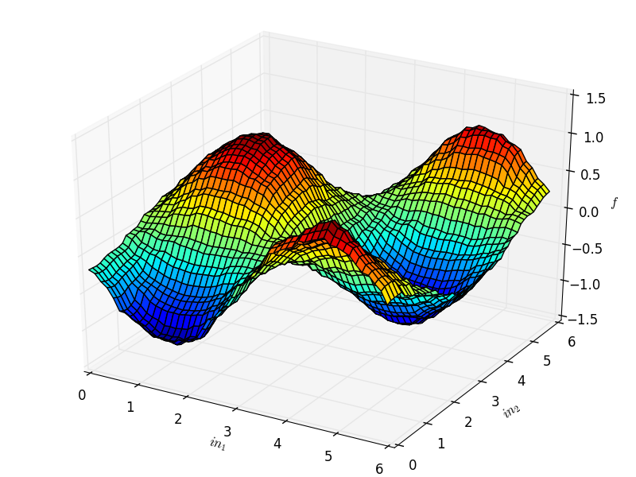

# Supervised learning using Tile coding

## Problem Description
Consider the problem of attempting to predict what output you'd expect given a specific input. 

## Solution
If you knew the function used to derive the output, this would be simple. When training examples exist (inputs mapped to outputs), supervised learning techniques are able to solve this problem fairly easily.  

In this example, we'll use tile coding to estimate a function (a sine function sin(in1 - 3.0) * cos(in2) + normal(0, 0.1)) after building our own training set.

## Usage
There are 2 main files:

1. [Tilecoder.py](Tilecoder.py)
  * This receives a state representation (in1 and in2) and represents it as an approximation using Tile coding. Without approximation, the state space would be infinite in this task since in1 and in2 are continuous values.
2. [SuperLearn.py](SuperLearn.py)
  * Responsible for the agent learning. 
  * Simulates the function that is being approximated

The simplest way to watch the algorithm learn the function being approximated. 

```python
from SuperLearn import *
learn(1000000)
writeF("testdata.dat")

#at command line
python3 plot.py testdata.dat
```

## Results
The following is the graph of the function learned.



## Reference
This is an adaption of a programming assignment from CMPUT 609 taught by Rich Sutton at the University of Alberta in 2016
